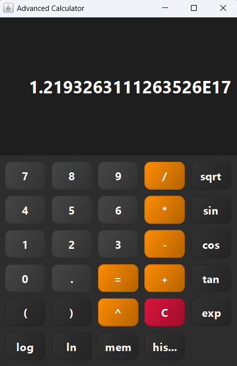

# 🖩 Java Calculator


---

## 🚀 About
🖥️ A simple Calculator app built in **Java using Swing**.  
Supports basic arithmetic operations: **Addition, Subtraction, Multiplication, Division**.  
Perfect for learning Java GUI programming and event handling.

---

## ✨ Features
- ➕ Addition
- ➖ Subtraction
- ✖️ Multiplication
- ➗ Division
- 🖱️ Clickable buttons (no console input)
- ⚡ Responsive GUI using Java Swing

---

## 📸 Project Preview



---

## 🚀 How to Run
1. Clone the repository
    ```bash
    git clone https://github.com/AbhayDutta/Java-Calculator.git
    cd Java-Calculator
    ```
2. Compile the code
    ```bash
    javac src/Calculator.java
    ```
3. Run the app
    ```bash
    java -cp src Calculator
    ```

---

## 📝 License
MIT — free to use, modify and share.  
If you find this useful, give it a ⭐ on GitHub!

---

## 🔥 Made with ❤️ by Abhay Dutta
